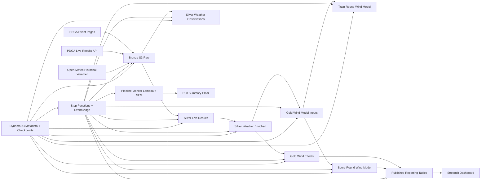

**Plan**
- Draft a hiring-focused `README.md` that sells the project quickly and still holds up technically.
- Make the README the front door for three audiences: recruiter, hiring manager, and technical interviewer.
- Use it to point into the deeper docs structure we already agreed on.

## Full file: `README.md`

```md
# Disc Golf Wind Effects

An AWS-native data platform and analytics project that estimates how weather, especially wind, changes disc golf scoring difficulty.

This project ingests PDGA tournament data and historical weather observations, builds Bronze/Silver/Gold datasets in S3, trains a production-style round-level model, scores events, publishes analytical reporting tables, and serves an interactive Streamlit dashboard. The goal is to answer a deceptively simple question with reproducible data engineering and model-based analysis:

**How many strokes does wind add, under what conditions, and where does it matter most?**

## Why This Project Exists

Weather clearly affects disc golf, but measuring that impact well is hard.

Raw scoring alone is not enough because observed scores are also influenced by:

- course and layout difficulty
- player skill
- division differences
- event timing
- temperature and precipitation
- missing or inconsistent source data

This project treats that as a real analytics engineering problem rather than a one-off notebook exercise. It builds a replayable pipeline, aligns weather to event timing and location, creates stable analytical datasets, and uses model-based expected scoring to estimate how weather changes round performance.

## What This Project Demonstrates

This repository is designed to show practical, portfolio-grade skills across data engineering, analytics engineering, and data science:

- building idempotent ingestion and transformation pipelines
- modeling Bronze / Silver / Gold data layers
- storing raw and analytical data in S3 as replayable artifacts
- orchestrating AWS-native workflows with Step Functions and EventBridge
- tracking checkpoints, run summaries, and pipeline metadata in DynamoDB
- training and scoring a production-style round-level model
- publishing analytical outputs for dashboards and investigation
- monitoring pipeline runs with timing, counts, metrics, utilization, and estimated cost
- presenting results through a Streamlit dashboard

## Project Question

The main business / analytical question is:

**How much does wind increase scoring difficulty in disc golf, and how does that vary by event, venue, player context, and weather conditions?**

Supporting questions include:

- Which events or venues are most weather-sensitive?
- How does weather impact vary by division or player skill level?
- Under what wind or temperature conditions does scoring move the most?
- Can a model-based expected score provide a cleaner baseline than raw comparisons alone?

## Live Dashboard

- Streamlit dashboard: `TODO: add deployed Streamlit URL`
- Main app entrypoint: `streamlit_app.py`
- Dashboard package: `dashboard_weather_impacts/`

The dashboard reads published Gold reporting tables and scored-round outputs from S3 and provides views for:

- overview trends
- geography
- event exploration
- methodology / interpretation

## Architecture

### High-level flow



### Core AWS services

- `S3` for Bronze, Silver, Gold, model artifacts, and dashboard/report outputs
- `DynamoDB` for metadata, checkpoints, and run summaries
- `ECS Fargate` for pipeline job execution
- `Step Functions` for orchestration
- `EventBridge` for scheduled triggers and post-run monitoring triggers
- `Athena` for reporting-table refreshes and analytical table access
- `Lambda + SES` for pipeline monitoring email delivery
- `Streamlit Community Cloud` for dashboard delivery

## Pipeline Layers

### Bronze
Replayable raw source snapshots with fetch metadata.

Examples:
- PDGA event HTML
- PDGA live-results JSON
- Open-Meteo archive weather JSON

### Silver
Typed, cleaned, normalized datasets with stable schemas and validation steps.

Examples:
- player rounds
- player holes
- normalized hourly weather observations
- weather-enriched round and hole data

### Gold
Analytics-ready datasets, features, scored outputs, and reporting tables.

Examples:
- weather impact fact tables
- model-input round dataset
- scored round outputs
- dashboard reporting aggregates

## Current Pipeline Jobs

### Incremental / recurring pipeline
- `ingest_pdga_event_pages`
- `ingest_pdga_live_results`
- `silver_pdga_live_results`
- `ingest_weather_observations`
- `silver_weather_observations`
- `silver_weather_enriched`
- `gold_wind_effects`
- `gold_wind_model_inputs`
- `score_round_wind_model`
- `report_round_weather_impacts`

### Weekly retrain pipeline
- `train_round_wind_model`
- `score_round_wind_model`
- `report_round_weather_impacts`

These jobs are orchestrated in AWS Step Functions and designed to be idempotent, observable, and safe to rerun.

## Data Products

The project currently produces several important analytical artifacts:

- replayable raw source snapshots in S3
- normalized Silver parquet datasets
- Gold weather/scoring datasets
- round-level model-input features
- versioned training artifacts
- scored round outputs with prediction metadata
- published reporting tables for dashboard consumption
- pipeline monitoring summaries delivered by email

## Modeling Approach

The current production modeling direction is a **round-level one-stage model**.

At a high level:

- the model is trained on Gold round-level feature inputs
- it predicts round scoring expectation using course, player, and context features
- scored outputs can be compared against observed scores to estimate weather-related scoring shifts
- evaluation metrics include run-level `RMSE` and `MAE` for scoring jobs

This project is intentionally structured so the data platform and the analytical model can evolve independently. The modeling layer sits on top of stable data contracts rather than tightly coupled notebook-only logic.

## Monitoring and Observability

The project includes automated pipeline monitoring designed to feel production-style rather than notebook-style.

After each pipeline run, the monitoring layer can summarize:

- job duration
- total pipeline duration
- processed and failed counts by job
- scoring `RMSE` and `MAE`
- average and peak CPU utilization
- average and peak memory utilization
- estimated Fargate cost by job
- estimated Athena cost by job
- total estimated pipeline cost

These summaries are formatted into an HTML table and sent by email through SES.

This is an important part of the project because it shows operational thinking, not just transformation logic.

## Dashboard

The Streamlit dashboard is the user-facing layer for exploring the analytical outputs.

Current dashboard sections include:

- `Overview`
- `Geography`
- `Event Explorer`
- `Methodology`

The dashboard is backed by published reporting tables in S3 and uses `boto3`, `pandas`, `pyarrow`, `plotly`, and `streamlit` to query, load, and visualize results.

## Repository Structure

```text
dg_wind_effects/
├── dashboard_weather_impacts/
├── docs/
├── docker/
├── gold_wind_effects/
├── gold_wind_model_inputs/
├── ingest_pdga_event_pages/
├── ingest_pdga_live_results/
├── ingest_weather_observations/
├── infra_cdk/
├── report_round_weather_impacts/
├── score_round_wind_model/
├── silver_pdga_live_results/
├── silver_weather_enriched/
├── silver_weather_observations/
├── tests/
├── train_round_wind_model/
├── streamlit_app.py
└── pyproject.toml
```

## Technical Highlights

A few implementation choices that matter in this project:

- **Idempotent ingestion:** jobs are designed to be rerun without duplicating outputs
- **Replayable Bronze layer:** raw source snapshots are stored in S3 for audit and reprocessing
- **Checkpointed processing:** DynamoDB tracks job state, run summaries, and event-level status
- **Environment-driven orchestration:** Step Functions injects shared run metadata into ECS tasks
- **Production-style scoring:** training artifacts and scoring requests use fingerprinted metadata
- **Operational monitoring:** pipeline runs generate structured, human-readable monitoring output
- **Separate dashboard layer:** published analytical outputs are consumed by a deployable app

## Quick Start

### 1. Create and activate a virtual environment

```powershell
python -m venv .venv
.\.venv\Scripts\Activate.ps1
```

### 2. Install dependencies

```powershell
python -m pip install --upgrade pip
pip install -e .
```

For local dashboard-only work, you can also install from `requirements.txt` if you are using the lighter Streamlit deployment dependency path.

### 3. Configure environment variables

At minimum, most jobs use variables like:

```dotenv
PDGA_S3_BUCKET=...
PDGA_DDB_TABLE=...
AWS_REGION=us-east-2
```

Additional jobs require Athena and model-specific settings such as:

```dotenv
ATHENA_DATABASE=...
ATHENA_WORKGROUP=...
ATHENA_RESULTS_S3_URI=s3://.../query-results/
ATHENA_SOURCE_SCORED_TABLE=...
ATHENA_REPORTING_BASE_TABLE=...
PRODUCTION_TRAINING_REQUEST_FINGERPRINT=...
```

### 4. Run a job locally

Example:

```powershell
python -m ingest_pdga_event_pages.runner --incremental
```

### 5. Run the dashboard locally

```powershell
streamlit run .\streamlit_app.py
```

## Example Commands

### Incremental event-page ingestion

```powershell
python -m ingest_pdga_event_pages.runner --incremental
```

### Historical live-results ingest

```powershell
python -m ingest_pdga_live_results.runner --historical-backfill
```

### Silver live-results transform

```powershell
python -m silver_pdga_live_results.runner --run-mode pending_only --progress-every 25
```

### Train the round-level model

```powershell
python -m train_round_wind_model.runner --log-level INFO
```

### Score events with the current production model

```powershell
python -m score_round_wind_model.runner --log-level INFO
```

### Refresh dashboard reporting outputs

```powershell
python -m report_round_weather_impacts.runner --log-level INFO
``'